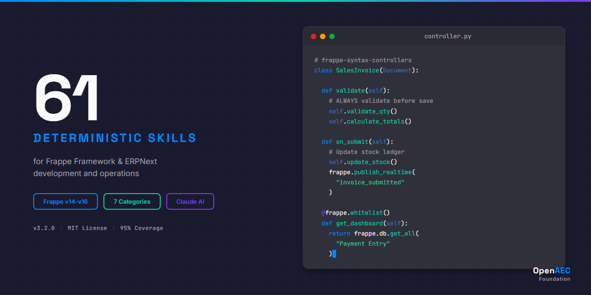

<p align="center">
  
</p>

<p align="center">
  <a href="#installation"></a>
  <a href="#version-compatibility"></a>
  <a href="https://agentskills.org"></a>
  <a href="LICENSE"></a>
</p>

---

# ERPNext Claude Skills Package

**28 deterministic skills** enabling Claude AI to generate flawless ERPNext/Frappe code. Built on the [Agent Skills](https://agentskills.org) open standard.

## Why This Exists

Claude is powerful, but without domain-specific guidance it generates ERPNext code that *looks* correct but fails in production. The #1 cause?

```python
# ❌ WRONG - This fails silently in Server Scripts
from frappe.utils import nowdate
today = nowdate()

# ✅ CORRECT - Server Scripts block all imports
today = frappe.utils.nowdate()
```

This package encodes 28 hard-won lessons like this into deterministic skills that Claude follows automatically.

## Skill Categories

| Category | Count | Coverage |
|----------|-------|----------|
| **Syntax** | 8 | Client scripts, server scripts, controllers, hooks, whitelisting, Jinja, scheduler, custom apps |
| **Core** | 3 | Database operations, permissions, API patterns |
| **Implementation** | 8 | Step-by-step development workflows |
| **Error Handling** | 7 | Production-ready error patterns |
| **Agents** | 2 | Code interpretation and validation |

## Installation

### Claude Code (Recommended)

```bash
git clone https://github.com/OpenAEC-Foundation/ERPNext_Anthropic_Claude_Development_Skill_Package.git
cp -r ERPNext_Anthropic_Claude_Development_Skill_Package/skills/source/* ~/.claude/skills/
```

### Claude.ai Web/Desktop

1. Download skill folders from `skills/source/`
2. ZIP each folder individually
3. Upload via **Settings → Capabilities → Skills**

### Claude.ai Projects

1. Create a new project
2. Upload `SKILL.md` files to the Knowledge section

## Version Compatibility

| Feature | v14 | v15 | v16 |
|---------|-----|-----|-----|
| Type annotations | ❌ | ✅ | ✅ |
| UUID autoname | ❌ | ✅ | ✅ |
| Data masking | ❌ | ❌ | ✅ |
| Scheduler improvements | ❌ | ✅ | ✅ |

## Documentation

- **[INDEX.md](INDEX.md)** — Complete skill descriptions
- **[USAGE.md](USAGE.md)** — Platform-specific guides
- **[WAY_OF_WORK.md](WAY_OF_WORK.md)** — 7-phase development methodology
- **[LESSONS_LEARNED.md](LESSONS_LEARNED.md)** — Technical discoveries

## Contributing

This package also serves as a **template** for building Claude skill packages in other technology domains. See `WAY_OF_WORK.md` for the methodology.

## License

MIT — See [LICENSE](LICENSE)

---

<p align="center">
  <sub>Built by <a href="https://github.com/OpenAEC-Foundation">OpenAEC Foundation</a> — Open standards for AEC technology</sub>
</p>
